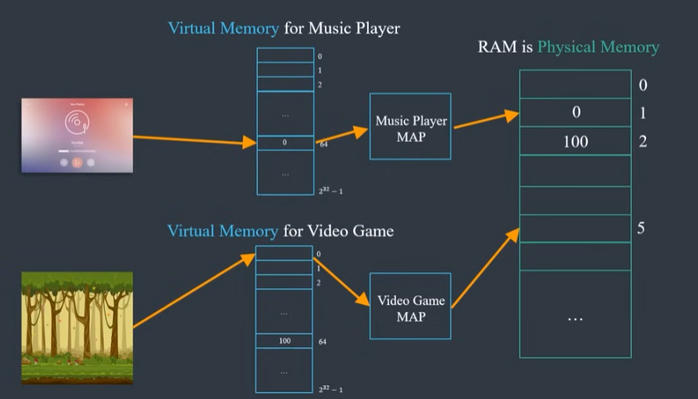
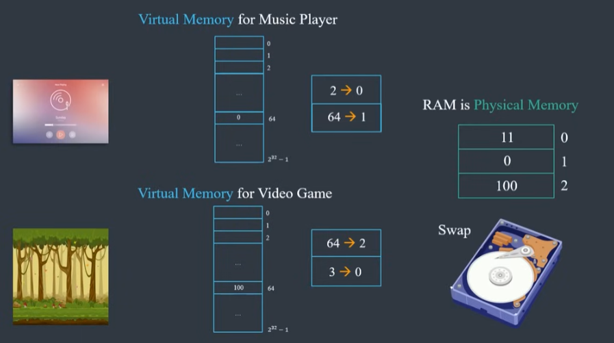
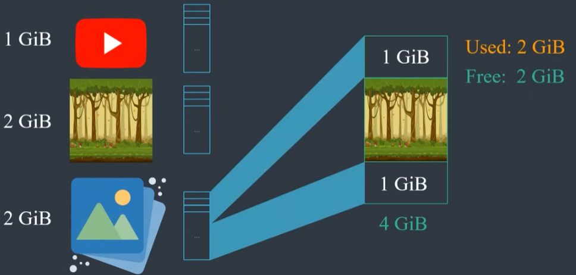
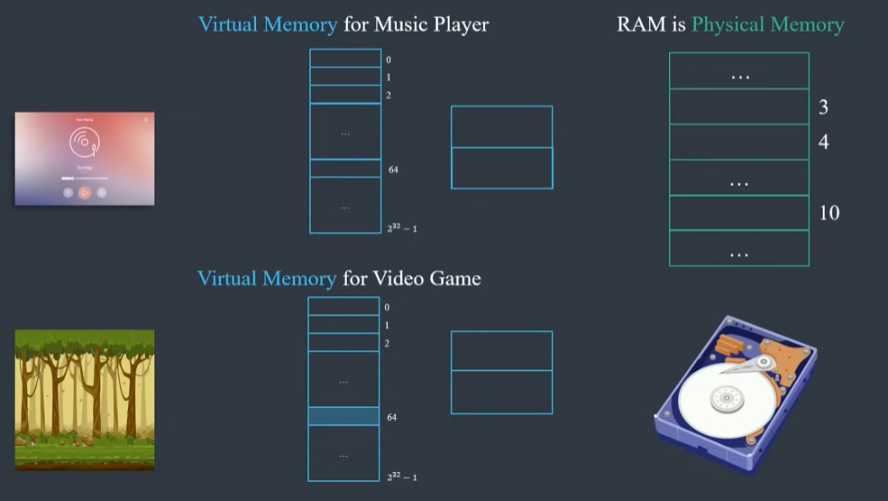
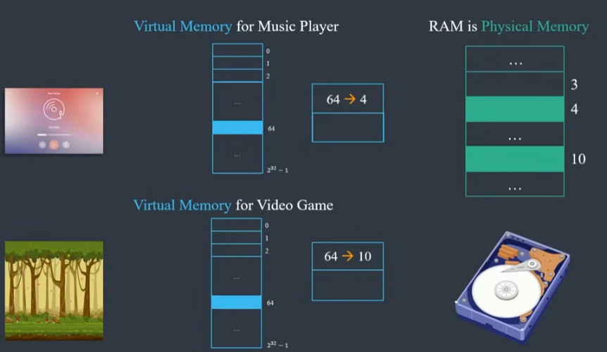
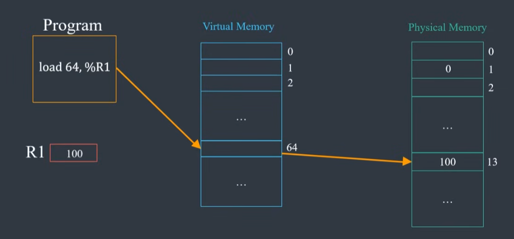
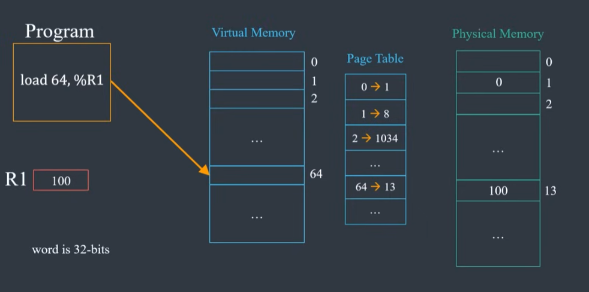
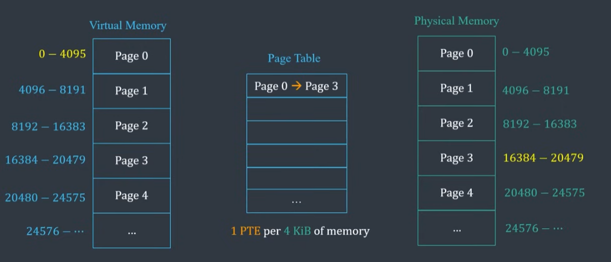

### Pointers 

Memory has address that is location of the memory meaning where that memory lives and value of
that memory is data stored at that location
pointer is just a value that stores an address

|Address|Value|
|---|---|
|0x1000|0x4|
|0x1004|0x1000|
|0x1008||
|0x1012||

Location 0x1000 has value 4, it got it probably from the following code

```c
int x=4;
```
Address 0x1004 has value 0x1000 which is an address, we get this from code

```c
int *pX = &x;
```

```c
int y = *pX;
```

\* in this case is called dereference operator, it means go to the address pointed to by the pointer and grab the value

---

### Vitual Memory

3 problems that virtual memory solves

- Not enough Memory
- Memory fragmentation
- Security

1) Not Enough Memory

Lets say we have 32 bit registers so 2^32 address but only 1GiB(1GB)(2^31) of RAM
When accessing the lower address we have no problem but when accessing higher address there is no memory to access
This is why programs used to crash in earlier days

2) Memory Fragmentation

Lets say we are running 3 programs, video player that requires 1GB of RAM, game that requires 2 GB of RAM and image editor requiring 2GB of RAM

If we run programs 1 and 2, they can fit in memory, they use 3GB leaving 1GB free, if we close the video player, memory usage will be 2GB and free space will also be 2GB but it will not be contiguous so now if we want to run the image editor that requires 2GB of space and we have 2GB of free space, we still cant run it because the memory is not contiguous, we can split our program across the 2 spaces of 1GB each

3) Security

Each program can access any 32 bit address, so when 2 programs write something at the same address, so these 2 programs would corrupt each others state

**If we give these programs these own memory space then we might be able to solve these problems**
**The memory space assigned to each program is called virtual memory and every program has its own virtual memory that dosent overlap with other programs**

##### Solution to Not Enough Space

But these means we have to map each programs virtual memory space to RAM(Physical space).
RAM addess -> Physical Address

Withour virtual memory, each program can access 32 bit address space which is directly mapped to RAM
With virtual memory, each program still has 32 bit address space but now we also have a map in the middle, this map know how to convert virtual addrss to physical address



What happens when program tries to access more data than what can fit in RAM or data that is currently not in RAM?
This data can be stored somewhere else like in the hard disk, the OS will swap the unused data in RAM with the requested data and it will also update the mapping
**The mapping allows us to use a disk to give additional memory when needed. This additional memory is called swap memory**



**When data not available in RAM and we have to go read it from a disk, we call it page fault**

##### Memory Fragmentation Solution 

Our previous example of 3 process of video player(1GB), a game(2GB) and an image editor(2GB), we were left with 2GB of free space but that space was not contiguous



**With virtual memory, we can map parts of program to available memory chunks**
From programs perspective nothing has changed and to it the memory is still contiguous

##### Solution to Security



In this example, the music player and the game have their own virtual address space



Here we can see that even though both programs try to write at address 64, it is mapped to different phusical address so one program cannot corrupt other programs
But complete isolation is also not great because programs wouldnt be able to share any data
**For programs to share data, the easy fix is parts of each program mapping to same physical space**
This is used when programs need to access same libraries like libc or win32 api

### Virtual Memory Implementation

Lets say program want to load data from address 64 into a register
First it has to find a mapping from virtual address 64 to a physical address and then read data from physical address



This map is called a page table, and each entry is called a page table entry



CPU work with words which is size of CPU registers which in our example is 32 bits so technically page table has an entry for each word in the virtual address space

These are 2^32 address each corresponding to a single byte which means there are 2^30 words
**Each process has its own page table**

We divide memory into chunks which we call pages and we map pages of memory instead of each individual word



This means we dont need single page table entry for each word instead we need 1 entry for every 4KB of data(in our example)
Which is 1024 words per page table entry(since each entry is 4 bytes or 32 bits and we have 1 entry for 4096 bytes=4*1024 bytes)

The trade off here is that instead of moving 1 word, we now have to move entire page to move data but this works quite well in practice because nearby memory locations are often access at same time


##### Page faults

We try to access some data but it is not currently in the RAM
CPU cannot read data from disk and raises and exception, this exception is called page fault
The OS evicts some page based on the algorithm used for page replacement, if the page is dirty, the OS writes it back to the disk
Dirty means program has written something to it after loading it from the disk
If program has not written anything to it then no need to write it to the disk since its contents have not changed
Then OS load requested page from disk into RAM and updates the page table and goes back to executing the same instruction that caused page fault
Page fualts are very slow so when they occur, the OS switches to execute another process in the mean time
Since disk IO is very slow mordern CPU architechture have modules called DMA(Direct Memory Access)
DMA can load data from disk to RAM directly while the CPU is doing something else

**Special hardware component that caches translations from virtual to physical address is called Translation Lookaside Buffer**

This translation is very fast
Mordern CPU architechtures have 2 TLB, one for instructions and 1 for data
TLB's only have aroung 4096 entries this is why TLB are constantly being updated but this works well in practice because of data locality

CPU generally have 2 levels of TLB caches
Another common practice is to have a module similar to DMA to load pages directly from RAM to TLB without having to go back to the OS
We need the page table in RAM because CPU need page table at every instance to translate virtual address to physical address so we cannot have Page table in the hard disk

If page table is not in RAM we cannot find it and we are already swapping pages in and out of Disk
To solve this issue we can use another level of page table entries for each program
The first level page table entries provide translation of virtual address to page entry in second level and second level provides final translation to physical address

